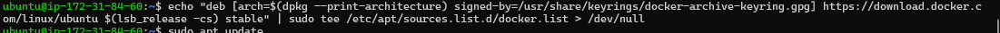

a)

### test.jenkinsfile

### Cleanup Stage
Dit beeld toont de stage voor het opruimen van de workspace.

### Dependencies Installation
Dit beeld toont de installatie van de benodigde Node.js dependencies.

### Post Stage
Dit beeld toont de post-verwerking die wordt uitgevoerd na de pipeline.

### Tools Stage
Dit beeld toont de installatie van de gebruikte tools in de pipeline.

### Console Output
Dit beeld toont de console-uitvoer van de jenkinsfile

### Docker build, push en deploy

Om docker te kunnen pushen ga ik credentials username met password toevoegen in jenkins:

Docker image is succesvol naar DockerHub gepusht 

Console output:

b)

# Production Server
> **Author - Raphael *(everything below this point)***

## Installeren Docker
Installatiegids: https://www.digitalocean.com/community/tutorials/how-to-install-and-use-docker-on-ubuntu-22-04

Ondernomen stappen:
1. Updaten huidige packages
   1. sudo apt update
   2. PowerShell: 
2. Installeren packages om de package manager via HTTPS te laten communiceren (Docker repos gebruiken HTTPS)
   1. sudo apt install apt-transport-https ca-certificates curl software-properties-common
   2. PowerShell: 
3. Toevoegen GPG key (authenticatie met Docker repositories)
   1. curl -fsSL https://download.docker.com/linux/ubuntu/gpg | sudo gpg --dearmor -o /usr/share/keyrings/docker-archive-keyring.gpg
   2. PowerShell: 
4. Toevoegen Docker repo aan package lijst (resource list)
   1. echo "deb [arch=$(dpkg --print-architecture) signed-by=/usr/share/keyrings/docker-archive-keyring.gpg] https://download.docker.com/linux/ubuntu $(lsb_release -cs) stable" | sudo tee /etc/apt/sources.list.d/docker.list > /dev/null
   2. PowerShell: 
5. Refreshen van de resources lijst
   1. sudo apt update
   2. PowerShell: 
6. Kijken of de docker-ce package beschikbaar is om te downloaden
   1. apt-cache policy docker-ce
   2. PowerShell: 
7. Installeren Docker Community Edition
   1. sudo apt install docker-ce
   2. PowerShell: 
8. Checken of Docker aan het runnen is
   1. sudo systemctl status docker
   2. PowerShell: 

## Vermijden van sudo
1. Add user to docker group
   1. sudo usermod -aG docker ${USER}
   2. PowerShell: 
2. AWS Ubuntu instance heeft geen passwoord, deze eerst instellen
   1. sudo passwd ubuntu      
   2. PowerShell: 
3. Log terug in
   1. su - ${USER}
   2. PowerShell: 
4. Kijken of de gebruiker in de "docker" groep is
   1. groups
   2. PowerShell: 

## Setting up the pipeline & other preparations
1. Pipeline integratioe met production.jenkins. Ik heb besloten SSH te gebruiken omwille van de volgende redenen
   1. het vermijdt het gebruik van gebruikersnamen en passwoorden, het is dus veiliger
   2. het is in het algemeen makkelijker om hiermee te werken, eens de keypairs matchen moet je niet nog eens een passwoord ingeven, het is dus ook deels uit gemakzucht (zoals een echte programmeur)
   3. we hebben de vorige keer pijnlijk ondervonden dat HTTPS niet werkt op een privé repository, het gebruik van SSH is dus flexiebeler en staat ons toe in de toekomst ooit onze repo van publiek naar privé om te zetten
   4. 
2. Installeer/Update SSH Agent in Jenkins
   1. 
3. Configureren van de SSH Agent: een nieuwe SSH key genereren voor toegang van de testserver naar de production server
   1. 
4. Toevoegen nieuwe inbound rule: IP adress testserver moet geaccepteerd worden door production server (vergeet de "/32" niet)
   1. 
5. Kijken of we kunnen verbinden vanuit de test server naar de productie server
   1. 

## The actual pipeline
1. Connectie werkt! De Jenkins (testserver) kan nu dus communiceren met de productieserver. Tijd om de pipeline te runnen...
   1. Pipeline Script: 
   2. Pipeline Output Pt. 1:
   3. Pipeline Output Pt. 2:
   4. Pipeline Output Pt. 3:
